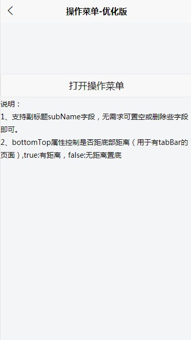
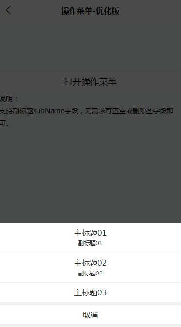

### nk-action-sheet

### 版本说明
* 1.0.0版本:支持副标题

### 功能
* 底部操作菜单，主副标题

### 适用场景
* 操作，选择
 
## 功能预览



## 使用方式

* 引入相关文件并初始化，详情参看pages/index/index.vue

```
<template>
	<view>
		<br/><br/><br/><br/>
		<button @click="showNkAction">打开操作菜单</button>
		<view>说明：</view>
		<view>
			支持副标题subName字段，无需求可置空或删除些字段即可。
		</view>
		<!-- 操作菜单 组件 -->
		<nkActionSheet :show="nkAction.show" :actions="nkAction.actions" @close="showNkAction" @cancel="showNkAction" @select="onSelect"></nkActionSheet>
		
	</view>
</template>

<script>
	import nkActionSheet from '@/components/nk-action-sheet.vue';
	export default {
		components: {nkActionSheet},
		data() {
			return {
				nkAction: {
					actions: [{
							name: "主标题01",
							subName: "副标题01",
							value: "1"
						},
						{
							name: "主标题02",
							subName: "副标题02",
							value: "2"
						},
						{
							name: "主标题03",
							subName: "",
							value: "3"
						}
					],
					show: false
				}
			};
		},
		onLoad() {},
		onShow() {
			uni.setNavigationBarTitle({
				title: "操作菜单-优化版"
			})
		},
		onReady() {},
		methods: {
			showNkAction: function() {
				this.nkAction.show = !this.nkAction.show;
			},
			onSelect: function(e) {
				console.log(e)
				this.nkAction.show = false
			},
		}
	}
</script>

<style scoped>
</style>


```

